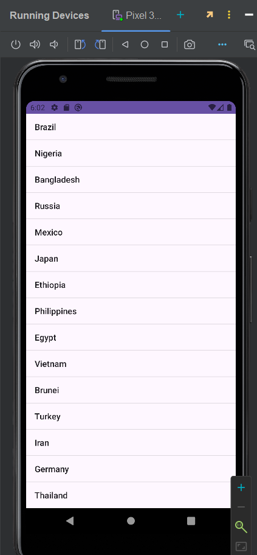

# This readme file shares what I learned and what I utilize in developing this activity

## Main Components
### MainActivity
- This is where I defined the logic
- Defined the list of countries
- Defined contentView, which is "activity_main.xml"
- Defined the listView based from "activity_main.xml"
- Utilized ArrayAdapter for display. Each country in countryList, it will create an instance of listView using simple_list_item_1 view

### activity_main.xml
- This is where I set the layout's logic
- Used LinearLayout ( doesn't make a difference with relative right now because it consumes the whole space and it is listed from top to bottom )
- The linear layout is set to match the parent's width and height, meaning sinasakop ang buong screen even though maliit lang yung space na ginamit
- created a listView here.

### What I learned:
  - You can find an item from the layout folder using "findViewById". (Note: You need to set an ID to the View in order to access them)
  - Adapters are responsible with displaying data. In my implementation, I used simple_list_item_1 for the display and countryList as the content of the view.

### The application:

